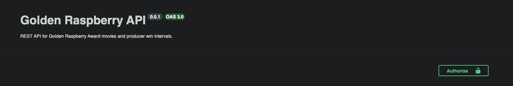

# Golden Raspberry Award API

## 1 - Foco do projeto

Nesse ambiente foi desenvolvido uma API RESTful para listar os produtores com:

- Produtores com maior intervalo de tempo entre filmes premiados
- Produtores com menos intervalo de tempo entre filmes premiados

## 2 - O que é o projeto?

A aplicação consiste em uma adição em massa de filmes para popular o ambiente e uma API focada em adição de filmes para que possa ser disponibilizado os produtores conforme a funcionalidade acima.

A leitura do dataset é feita através de um CSV, que é interpretado separando tanto os filmes, quanto o intervalo dos produtores entre seus filmes vencedores

A API de filmes disponibiliza a possibilidade de adicionar, alterar, listar, deletar filmes e listar os produtores com maior e menor intervalo entre seus filmes vencedores

O ambiente exige autenticação, logo foi criado dois usuários padrão salvos em memória: 

- Usuário : root e senha : root
- Usuário : admin e senha : admin

## 3 - Tecnologias

- TypeScript (Runtime)
- NestJs (Framework backend)
- TypeORM (Gestor de banco de dados)
- SQLite (Banco de dados)
- csv-parse (leitura de CSV)

## 4 - Requisitos mínimos

- Node.js 23 LTS
- Npm

## 5 - Instalação

Instalação com o comando:  `npm install`

## 6 - Configuração

Para a configuração será necessário ter um arquivo .env (ja existe no projeto) com as informações:

JWT_SECRET=mxQ6qwPa8WuGGXZCiuF9zSdT3EBqzAfBwEUjRBqpuD8
MOVIE_FIXTURE_PATH=src/utils/dataset-bootstrap/fixture/Movielist.csv

O MOVIE_FIXTURE_PATH pode ser alterado com um novo caminho para que possa ser utilizado um novo dataset, desde que possua o mesmo formato do primeiro

## 7 - Validação

Foram adicionados diversos testes ao de integração ao longo de cada módulo para garantir o seu funcionamento adequado. Todos os testes podem ser passados através do comando:

`npm run test`

## 8 - Uso

Para facilitar o uso da API, foi adicionado ao projeto a documentação baseado no padrão Open API.

A documentação pode ser encontrada em: [http://localhost:3000/docs#/](http://localhost:3000/docs#/)

É importante fazer o login em `POST /auth/login` (`root`/`root` ou `admin`/`admin`) antes de chamar os outros endpoints. 

Swagger POST /auth/login

Copie o valor de `access_token`

Suba a parte superior do sistema e clique em "Authorize"

Cole o `access_token` na entrada desse modal:

Depois você poderá interagir com a API com a autenticação correta

## 9 - Decisões técnicas

### 9.1 - NestJs

A minha escolha para esse projeto ter sido NestJs foi pela sua facilidade de implementação de certos ativos, com ferramentas já prontas dentro do framework, os motivos mais concretos são:

- Nivel de maturidade de Richardson : Temos um método previsível e bem documentado para obtermos uma semântica adequada, tanto para os métodos, como a adição de etags para a cacheabilidade do sistema;

- Arquitetura : Por se tratar de um framework opnativo o seu uso atráves da CLI, fica muito mais fácil para entregar um ambiente organizado com estrutura que faz sentido por domínios;

- DTO's : O próprio nest ja lê os DTO's adicionados e cria os metodos que vão utiliza-los, dando agilidade na construção das entidades. A segurança de ter um validador de formato para que dados sensíveis não sejam vazados na api, é muito importante;

- Pipes: O uso dos pipes e excencial quando queremos tanto entregar uma aplicação robusta, mas também para que o nível 2 de richardson seja aplicado de forma satisfatória.

### 9.2 - TypeORM

Já é o ORM que estou utilizando no dia a dia, particularmente eu gosto da separação por entidade / metodos que estão disponíveis para a mesma.

Não vejo muita diferença entre utilizar por exemplo Prisma, é mais questão de afinidade com a ferramenta.

### 9.3 - SQLite

Seu uso foi escolhido pelo requisito não funcional de ser um banco em memória SGBD

### 9.4 - Swagger

Documentação é imprescindível quando temos uma aplicação, a forma que o nest e swagger trabalham faz com que seja muito fácil esse passo

### 9.5 - Watched List

Para armazenar os dados de forma rápida e dinâmica eu escolhi o design pattern da watched list, isso facilita muito para guardar os dados de todos os produtoes de filmes e suas informações entre seus filmes ganhadores, já tratados e salvos em uma tabela separada.

Ele foi implementado com um refresh do dataset total, porém poderia ser adicionado de forma apenas para atualizar os filmes que estão sendo adicionados/modificados.

Não foram adicionados indices e nem particionamento, mas o uso de indices para é muito importante em um uso de um dataset grande.

### 10 - Código

Maioria do código foi tirado diretamente da documentação do nest :

https://docs.nestjs.com/techniques/database
https://docs.nestjs.com/techniques/validation
https://docs.nestjs.com/security/authentication
https://docs.nestjs.com/techniques/http-module
https://docs.nestjs.com/openapi/introduction

### 11 - Melhorias

Poderia ter sido adicionado nesse projeto:

- Cache : Através dos interceptadores, poderiamos ter utilizado uma camada de cache para o sistema. Isso iria facilitar o uso com grande datasets, desde que a invalidação fosse feita toda vez que uma atualização fosse feita em algum filme.

- Auth : Foi apenas utilizado valores padrão de usuário para a autenticação, não tendo um CRUD realmente pronto para fazer a gestão concreta dos usuários.

- Autorização: Seria interessante ter criado roles para os tipos de usuários, isso ajuda no permissionamento dos mesmos:

Por exemplo:

- Root: pode fazer todas as ações do crud de filmes
- Admin : Pode alterar/criar filmes
- User : Pode visualizar filmes e os produtores dos mesmos

