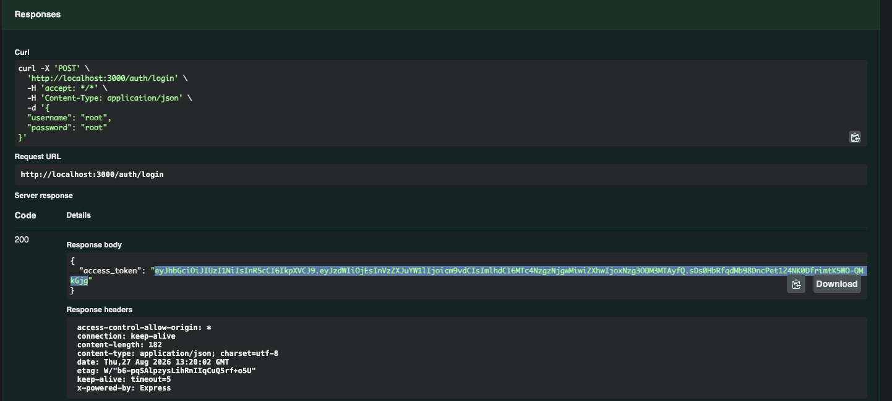
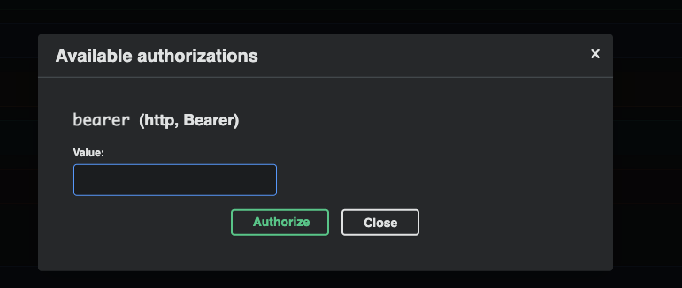

# Golden Raspberry Award API

## 1 - Foco do projeto

Nesse ambiente foi desenvolvido uma API RESTful para listar os produtores com:

- Produtores com maior intervalo de tempo entre filmes premiados
- Produtores com menos intervalo de tempo entre filmes premiados

## 2 - O que é o projeto?

A aplicação consiste em uma adição em massa de filmes para popular o ambiente e uma API focada em adição de filmes para que possa ser disponibilizado os produtores conforme a funcionalidade acima.

A leitura do dataset é feita através de um CSV, que é interpretado separando tanto os filmes, quanto o intervalo dos produtores entre seus filmes vencedores

A API de filmes disponibiliza a possibilidade de adicionar, alterar, listar, deletar filmes e listar os produtores com maior e menor intervalo entre seus filmes vencedores

O ambiente exige autenticação, logo foi criado dois usuários padrão salvos em memória: 

- Usuário : root e senha : root
- Usuário : admin e senha : admin

## 3 - Tecnologias

- TypeScript (Runtime)
- NestJs (Framework backend)
- TypeORM (Gestor de banco de dados)
- SQLite (Banco de dados)
- csv-parse (leitura de CSV)

## 4 - Requisitos mínimos

- Node.js 23 LTS
- Npm

## 5 - Instalação

Instalação com o comando:  `npm install`

## 6 - Configuração

Para a configuração será necessário ter um arquivo .env (ja existe no projeto) com as informações:

JWT_SECRET=mxQ6qwPa8WuGGXZCiuF9zSdT3EBqzAfBwEUjRBqpuD8
MOVIE_FIXTURE_PATH=src/utils/dataset-bootstrap/fixture/Movielist.csv

O MOVIE_FIXTURE_PATH pode ser alterado com um novo caminho para que possa ser utilizado um novo dataset, desde que possua o mesmo formato do primeiro

## 7 - Validação

Foram adicionados diversos testes ao de integração ao longo de cada módulo para garantir o seu funcionamento adequado. Todos os testes podem ser passados através do comando:

`npm run test`

## 8 - Uso

Para facilitar o uso da API, foi adicionado ao projeto a documentação baseado no padrão Open API.

A documentação pode ser encontrada em: [http://localhost:3000/docs#/](http://localhost:3000/docs#/)

É importante fazer o login em `POST /auth/login` (`root`/`root` ou `admin`/`admin`) antes de chamar os outros endpoints. 

Swagger POST /auth/login

Copie o valor de `access_token`

Suba a parte superior do sistema e clique em "Authorize"

Cole o acess_token na entrada desse modal:

Depois você poderá interagir com a API com a autenticação correta

## 9 - Decisões técnicas

